##  Project Goal

The goal of this project is to build an automated security monitoring and incident-analysis system using **Splunk as the SIEM** and **n8n as the automation platform**.

The basic workflow is:
```
Windows 10
    │
    │ Security Logs
    ▼
Splunk SIEM
    │
    │ Relevant Events
    ▼
   n8n
    │
    │ Event Analysis
    ▼
ChatGPT / LLM (Ollama Phi used here)
    │
    │ Security Summary
    ▼
  Slack
```

Windows logs will be collected and sent to Splunk for centralized monitoring. Relevant events will then be passed to n8n, where ChatGPT will process and analyze the events. The final analysis will be automatically sent to Slack.

---
##  Virtual Machine Configuration

The project environment consists of the following virtual machines:

|Machine|Configuration|Purpose|
|---|---|---|
|Windows 10 Pro|4 CPU / 60 GB|Log generation|
|Kali Linux|4 CPU / 80 GB|Security testing|
|Ubuntu – n8n|4 CPU / 50 GB|Workflow automation|
|Ubuntu – Splunk|6 CPU / 100 GB|SIEM|
|Ubuntu – IRIS|6 CPU / 50 GB|Incident response|

The Splunk server is configured with the IP address:

```
192.168.182.128
```

---
## Initial System Configuration

The initial setup was performed on all virtual machines before starting the main deployment.

### SSH Configuration

SSH was configured on the Splunk and n8n Ubuntu servers to allow remote administration.

### Windows Remote Desktop

Remote Desktop was enabled on the Windows 10 Pro machine for easier remote access.

### Ubuntu Updates

All Ubuntu systems were updated and upgraded:

```
sudo apt update
sudo apt upgrade -y
```

### Windows Snapshot

A snapshot of the Windows 10 Pro machine was created before starting the security-testing phase. This provides a recovery point if any configuration or testing causes unwanted changes.

---
# Splunk Installation

Splunk was selected as the central SIEM for collecting, indexing, and analyzing security logs.

The Splunk `.deb` package was downloaded from the official website and installed using:

```
sudo dpkg -i <splunk-package>.deb
```

After installation, the Splunk directory was accessed:

```
cd /opt/splunk/bin
```

Splunk was configured to run using the dedicated `splunk` user:

```
sudo -u splunk bash
```

The installation directory was then accessed again:

```
cd /opt/splunk/bin
```

---
## Configure Splunk to Start Automatically

To make sure Splunk starts automatically whenever the Ubuntu server boots, boot-start was enabled:

```
sudo ./splunk enable boot-start -user splunk
```

Splunk was then started manually for the initial configuration:

```
./splunk start
```

During the first startup, the license agreement was accepted and the initial administrator credentials were configured.

---
## Accessing Splunk

Once Splunk was running, the Web interface could be accessed from the host machine using port **8000**:

```
http://192.168.182.128:8000
```

The Splunk interface will be used for configuring indexes, receiving Windows logs, searching events, and creating security detections.


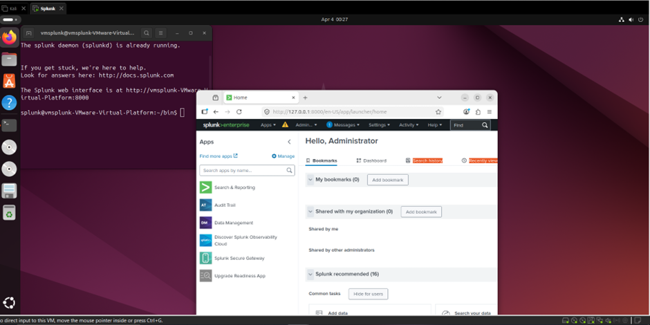

# Splunk Configuration

We will first configure Splunk to receive logs from the Windows machine.

### Configure Receiving Port

Go to:

**Settings → Forwarding and Receiving → Configure receiving → New Receiving Port**

Enter:

```
9997
```

This is the default receiving port used by the Splunk Universal Forwarder.

Click **Save**.


### Create a New Index

Next, we will create a separate index for the Windows logs used in this project.

Go to:

**Settings → Indexes → New Index**

Enter the index name: splunkproject

Press **Enter** and save the new index.

All Windows events collected for this project will be stored in this index.

---
### Install Splunk Add-on for Windows

Go to: **Apps → Find More Apps**

Search for: Windows Event

Install the **Splunk Add-on for Microsoft Windows**.

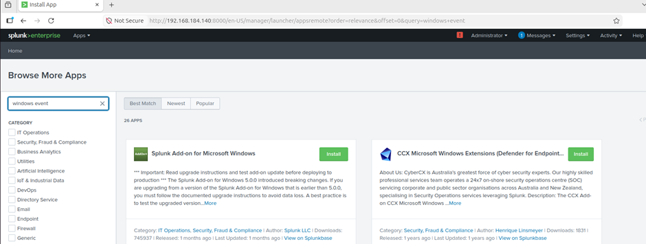

During the installation, Splunk may ask for the **Splunk account credentials**.

---
# Configuring Windows

Now we will configure the Windows machine to send its event logs to Splunk.

For this, we will use the **Splunk Universal Forwarder**.

Download and install the Universal Forwarder on the Windows 10 Pro machine.

During the setup, configure the credentials:

### Configure Deployment Server

During the Universal Forwarder setup, we will be asked for the deployment server information.

Enter the IP address of our Splunk server:

```
192.168.182.128
```

For the receiving port, enter:

```
9997
```

This allows the Windows Universal Forwarder to communicate with the Splunk server and forward the collected logs.

---
# Configure `inputs.conf`

After installing the Universal Forwarder, navigate to:

```
C:\Program Files\SplunkUniversalForwarder\etc\system\local
```

We will place our `inputs.conf` file inside this directory.

The configuration file defines which Windows event logs should be collected by the Universal Forwarder.

The `inputs.conf` file used in this project can be found here:

[inputs.conf](https://drive.google.com/file/d/1-qYp4oCrT1BqhG1oaprQfkFhgFIHiWEm/view)

### Important Configuration

The Windows event inputs should use the index:

```
index = splunkproject
```

This ensures that the Windows logs are stored inside the `splunkproject` index in Splunk.

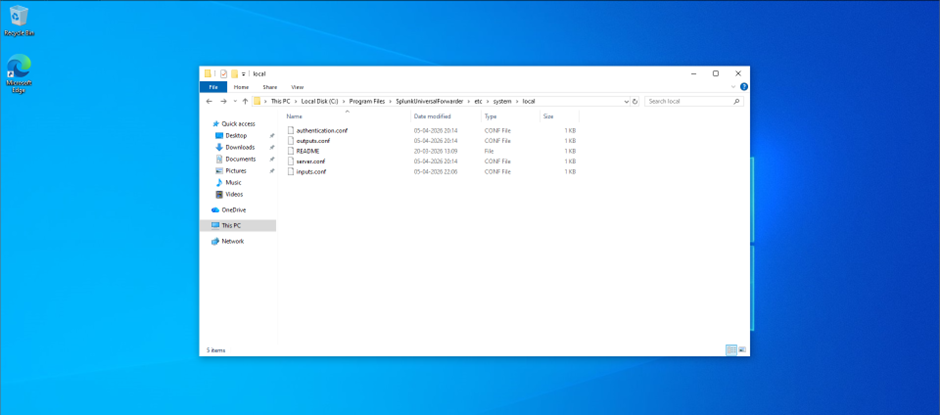

## Log Flow

The configuration at this stage can be represented as:

```
Windows 10 Pro
      │
      │ Windows Event Logs
      ▼
Splunk Universal Forwarder
      │
      │ TCP 9997
      ▼
Splunk Server IP
      │
      ▼
splunkproject Index
```

Next, we will verify that the Windows events are successfully reaching Splunk.

# Verify Windows Log Forwarding

After configuring the Universal Forwarder, we need to make sure that the Splunk Forwarder service is running with the correct permissions.

### Configure Splunk Forwarder Service

On the Windows machine, open **Services** as Administrator.

Find:

```
SplunkForwarder
```

Double-click the service and go to the **Log On** tab.

Select: **Local System account**

Click **Apply** and then **OK**.

Now right-click on the `SplunkForwarder` service and select: **Restart**

This will restart the Universal Forwarder with the updated configuration.

---
## Verify Logs in Splunk

Now go back to the Splunk Web interface:

```
http://<splunk-ip>:8000
```

Go to: **Apps → Search & Reporting**

Run the following search:

```
index=splunkproject
```

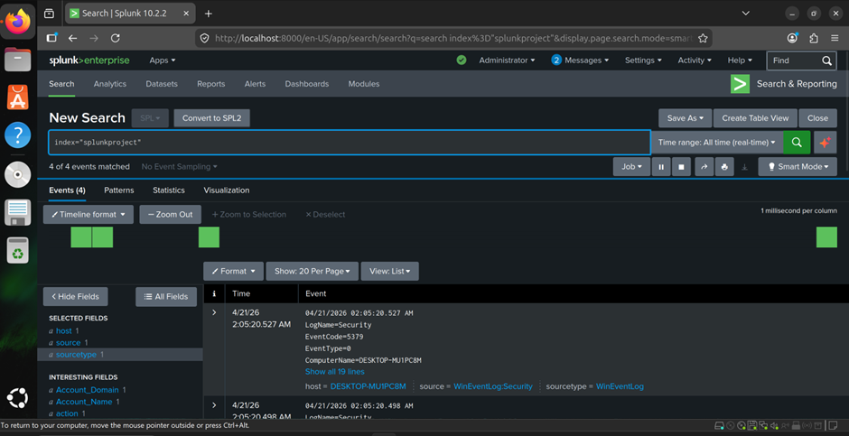

If the Windows events are displayed, the log forwarding setup is working correctly.

At this stage, the flow is:

```
Windows 10
    │
    │ Windows Events
    ▼
Splunk Universal Forwarder
    │
    │ Port 9997
    ▼
Splunk
    │
    ▼
splunkproject
```

---
# n8n Setup

Now that Windows logs are successfully reaching Splunk, we can continue with the automation part of the project.

**n8n** will be used as the workflow automation platform. It will later connect Splunk with the LLM and Slack.

## Install Docker

First, update the Ubuntu system:

```
sudo apt update
```

Install the required packages:

```
sudo apt install ca-certificates curl gnupg -y
```

Create the Docker keyring directory:

```
sudo install -m 0755 -d /etc/apt/keyrings
```

Download and add the Docker GPG key:

```
curl -fsSL https://download.docker.com/linux/ubuntu/gpg | sudo gpg --dearmor -o /etc/apt/keyrings/docker.gpg
```

Add the Docker repository:

```
echo \
"deb [arch=$(dpkg --print-architecture) signed-by=/etc/apt/keyrings/docker.gpg] https://download.docker.com/linux/ubuntu \
$(. /etc/os-release && echo $VERSION_CODENAME) stable" | \
sudo tee /etc/apt/sources.list.d/docker.list > /dev/null
```

Update the package list again:

```
sudo apt update
```

---
# Create n8n Directory

Create a dedicated directory for the n8n Docker configuration:

```
mkdir n8n-compose
```

Move into the directory:

```
cd n8n-compose
```

Create the Docker Compose file:

```
sudo nano docker-compose.yaml
```

Add the following configuration:

```
services:

  n8n:

    image: n8nio/n8n:latest

    restart: always

    ports:
      - "5678:5678"

    environment:
      - N8N_HOST=192.168.182.129
      - N8N_PORT=5678
      - N8N_PROTOCOL=http
      - N8N_SECURE_COOKIE=false
      - GENERIC_TIMEZONE=AMERICA/TORONTO

    volumes:
      - ./n8n_data:/home/node/.n8n
```

Save the file and exit the editor.

---
## Pull the n8n Image

Download the required n8n Docker image:

```
sudo docker compose pull
```

During the setup, Docker creates an `n8n_data` directory for storing n8n's configuration and data.

The directory may initially be owned by `root`, so we need to change its ownership.

```
sudo chown -R 1000:1000 n8n_data/
```

---
## Start n8n

Start the n8n container in detached mode:

```
sudo docker compose up -d
```

The `-d` option runs the container in the background.

---
# Access n8n

From the Windows machine, open a browser and enter:

```
http://<n8n-ip>:5678
```

For this setup, the n8n server is configured with:

```
192.168.182.129
```

Therefore:

```
http://192.168.182.129:5678
```

Complete the initial n8n account setup.

---
# Starting the Environment

For future sessions, make sure the following virtual machines are powered on:

```
Windows 10 Pro
Splunk Ubuntu
n8n Ubuntu
```

After starting the machines, verify that Splunk is accessible from Windows:

```
http://<splunk-ip>:8000
```

For this project:

```
http://192.168.182.128:8000
```

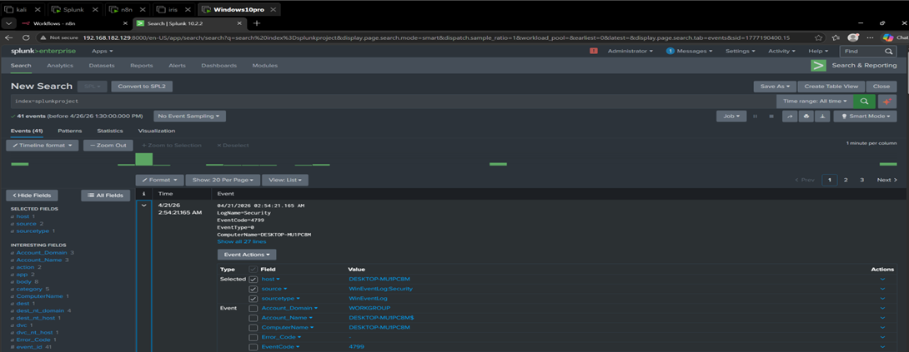

Once Splunk and n8n are running, we can continue with the **Splunk → n8n integration**.

# Splunk Event Detection

Now that Windows logs are successfully reaching Splunk, we can examine the available fields and identify the events that we want to monitor.

## Identify Event Fields

In Splunk, open the **Search & Reporting** application.

Click the sidebar to view the available fields in the collected events.

The field containing the Windows Event ID is:

```
EventCode
```

We can use this field to search for specific Windows security events.

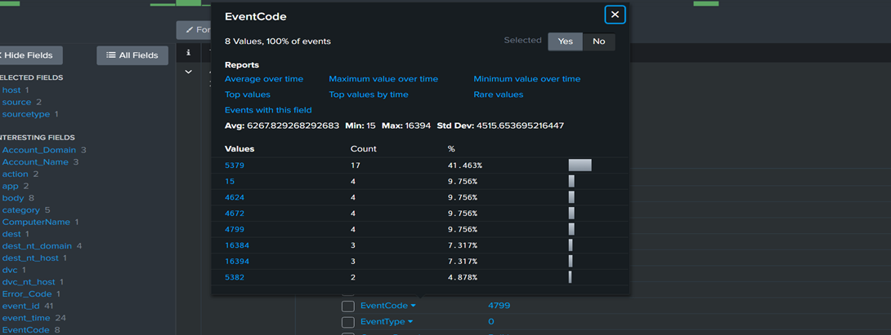

For example:

```
index=splunkproject EventCode=4799
```

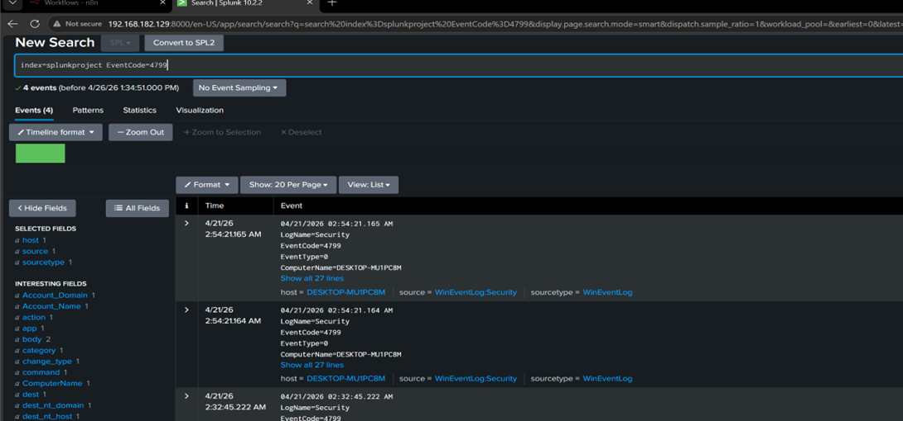

This search returned three events.

---
# Detect Failed Authentication Attempts

Next, we will monitor failed Windows authentication attempts.

Windows Event ID **4625** represents a failed logon attempt.

We can search for these events using:

```
index=splunkproject EventCode=4625
| stats count by _time,ComputerName,user,src_ip
```

This query groups the failed authentication events by:

- `_time` — Time of the event
- `ComputerName` — Affected Windows machine
- `user` — Account involved in the authentication attempt
- `src_ip` — Source IP address

We will generate controlled failed authentication attempts from the Kali Linux machine and verify that they are detected by Splunk.

### Event ID 4625

```
4625 = Failed Logon
```

This means that someone attempted to authenticate to the Windows system, but the authentication failed.

---
# Create a Splunk Alert

Once the search is working correctly, save it as an alert.

Go to: **Save As → Alert**

Configure the alert to run automatically.

### Schedule

Change: **Run Every → Cron**

Then set the Cron expression so that the search runs every minute: *

This allows Splunk to continuously check for new failed authentication events.

---
# Configure Alert Triggers

Under **When triggered**, configure the following actions:

### 1. Webhook

Add a **Webhook** trigger.

The n8n webhook URL will be added here later.

```
n8n Webhook URL
```

### 2. Add to Triggered Alerts

Also enable:

**Add to Triggered Alerts**

This allows the generated alert to be recorded in Splunk's triggered-alert system.

Save the alert configuration.

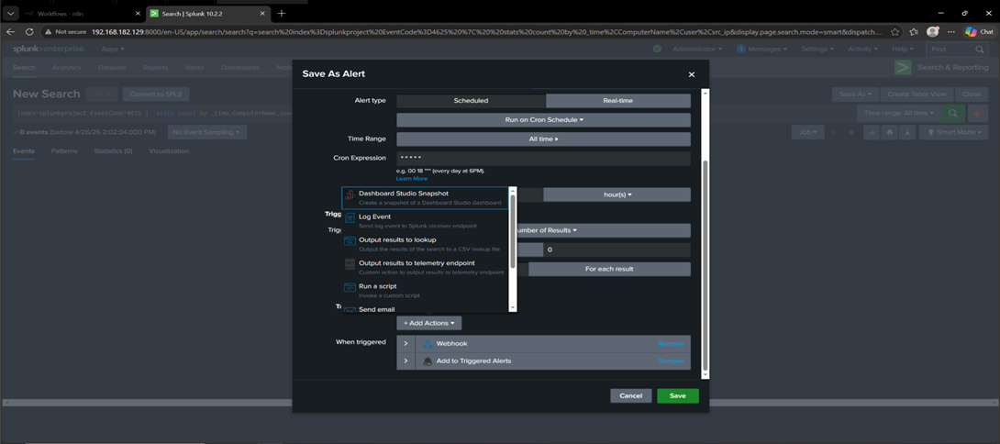

# Connect Splunk to n8n

Now we will connect the Splunk alert to our n8n workflow.

Open n8n and create a new workflow:

**Start from Scratch**

Click the **+** button and search for:

```
Webhook
```

Select the **Webhook** node.

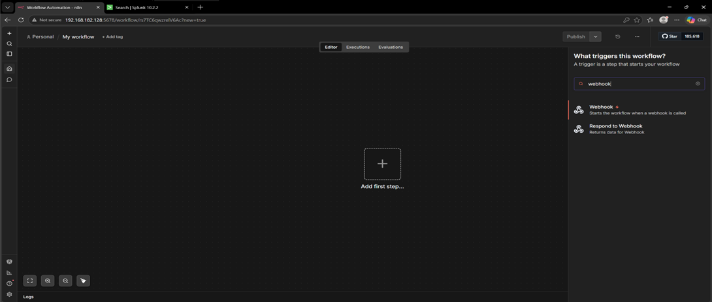

## Configure Webhook

Change the HTTP method from: GET to POST

Copy the webhook URL generated by n8n.

The URL will be added to the **Webhook** action in the Splunk alert configuration.

After adding the URL, save the Splunk alert.

## Test the Connection

Return to n8n and click: **Listen for Test Event**

Now trigger the Splunk alert.

If the connection is successful, n8n should receive the event data from Splunk.

This confirms the first part of the automation pipeline:

```
  Windows
    ↓
  Splunk
    ↓
Splunk Alert
    ↓
 Webhook 
    ↓
   n8n
```

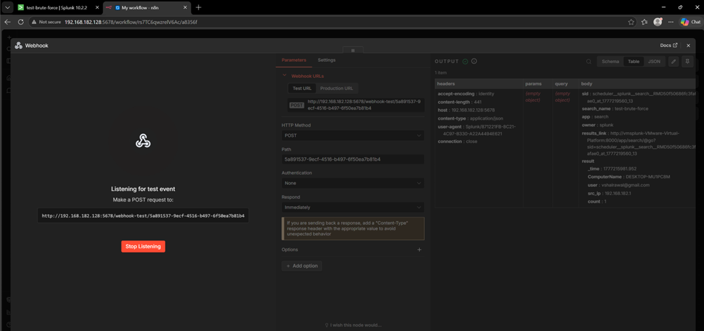
# Integrate OpenAI

Once n8n successfully receives the Splunk event, we can send the event to an LLM for analysis.

In n8n, click the **+** button and search for:

```
ChatGPT
```

Select: **OpenAI → Message a Model**

---
## Configure OpenAI Credentials

The OpenAI node requires an API credential.

Select: **Setup Credential**

Enter the OpenAI API key and save the credential.

# Configure the LLM Message

We will use different message roles to structure the request sent to the model: **System**

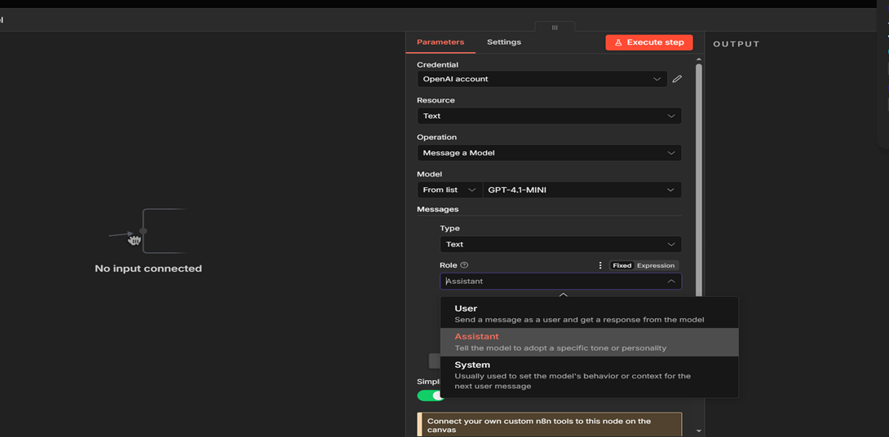

Defines how the model should behave and what role it should perform.

For example:

```
Act as a Tier 1 SOC Analyst assistant. When provided with a security alert or incident details (including indicators of compromise, logs, or metadata), perform the following steps:  
  
- Summarize the alert  
- Enrich with threat intelligence  
- Assess severity using MITRE ATT&CK  
- Recommend next actions

Format output clearly in:  
Summary, IOC Enrichment, Severity Assessment, Recommended Actions.
```

### User

Contains the actual event data received from Splunk. Here we set things we will take out from our user which will then go to system which will act on the basis of our customisation

```
Alert: {{$json.body.search_name}}

EventCode: {{$json.EventCode}}

User: {{$json.Account_Name}}

IP: {{$json.src_ip}}
```
# Slack Integration

After successfully connecting Splunk, n8n, and the LLM, the final step is to send the generated security analysis to Slack.

Slack will be used as the notification platform for our security alerts.
## Create Slack Channel

First, create a Slack account/workspace.

Create a dedicated channel for security alerts:

**Channel → + → Create a new channel**

Name the channel:

```
Alerts
```

This channel will be used to receive the alerts generated by our n8n workflow.

---
# Configure Slack in n8n

Go back to n8n and add a Slack node.

Select: **Slack → Send a Message**

Under credentials, select:

**Setup Credential**

n8n requires Slack authentication to send messages to the channel.

The OAuth setup instructions are available here:

[https://docs.n8n.io/integrations/builtin/credentials/slack/#using-oauth2](https://docs.n8n.io/integrations/builtin/credentials/slack/#using-oauth2)

---
## Configure Slack OAuth

Follow the OAuth setup instructions provided by n8n.

Under:

**OAuth & Permissions → Scopes**

Add the required Slack permissions.

For example:

```
channels:read
```

Add the other required scopes according to the n8n Slack integration requirements.

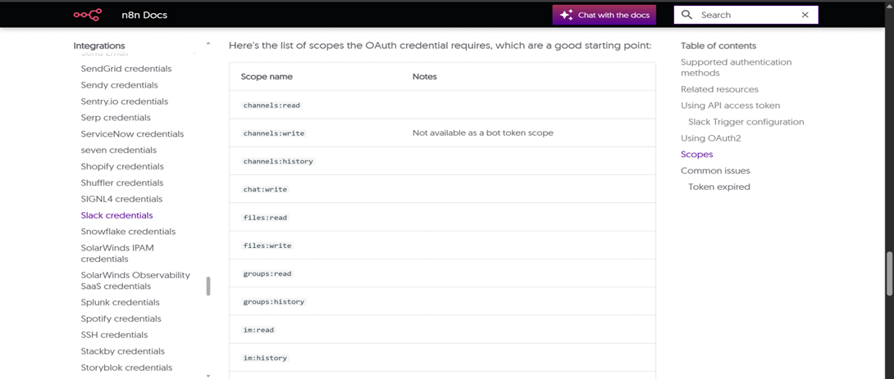

After configuring the required permissions, click:

**Install to `<project_name>`**

Copy the generated **OAuth Token**.

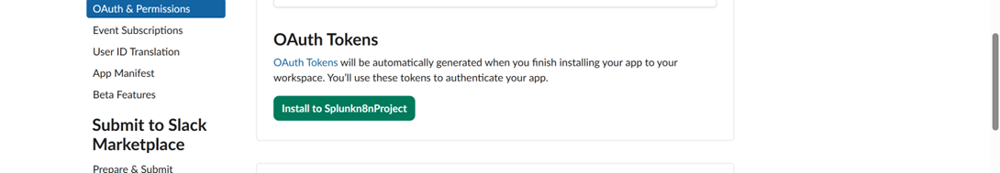

Return to n8n and paste the token into the Slack credential configuration.

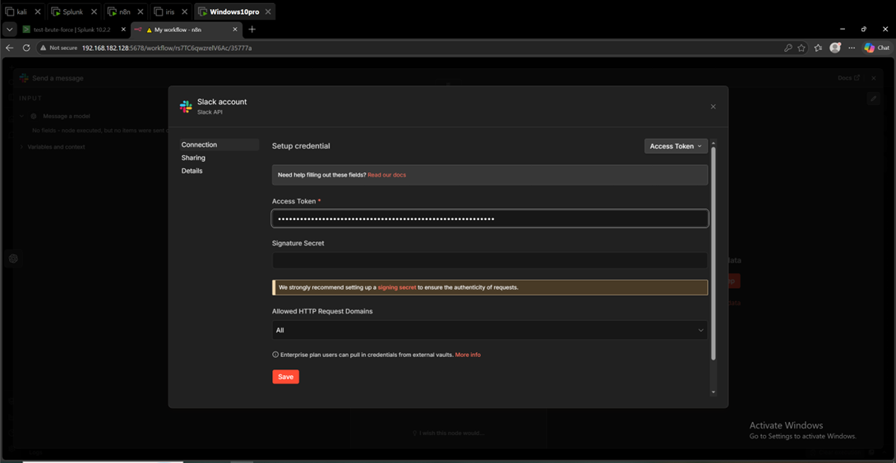

Save the credential.

For the credential signature/name, use:

```
splunk
```

---
# Configure Slack Message

In the Slack node, configure:

**Send Message To → Channel → Alerts**

At this point, a dry run may result in an error because the Slack application has not yet been added to the channel.

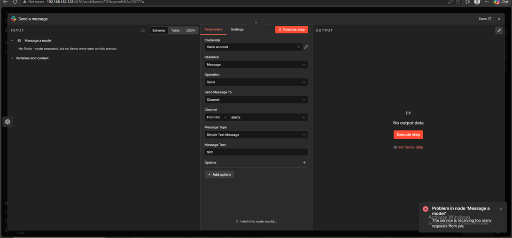

# Add the Slack App to the Channel

Go back to Slack.

Right-click the:

```
#alerts
```

channel and select:

**View Channel Details → Integrations → Add an App**

Add the Slack application created for the project.

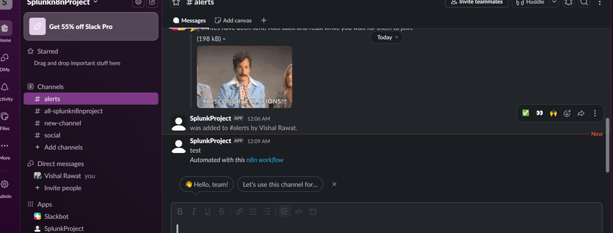

After adding it, the application should appear in the channel integrations.

This allows n8n to send messages to the `#alerts` channel.

---
# Send the LLM Output to Slack

Now we will pass the output generated by the LLM directly into the Slack message.

Instead of entering static text, drag the output from the previous node into the message field.

If the OpenAI node is not being used and the output is available as `message.content`, use:

```
{{ $json.message.content }}
```

Execute the workflow and verify that the generated analysis appears in Slack.

---
# Using Ollama Instead of OpenAI

During testing, an OpenAI API key was not available, so we used **Ollama** to run the LLM locally.

Install Ollama using:

```
curl -fsSL https://ollama.com/install.sh | sh
```

Start the Ollama service:

```
ollama serve
```

Download the Llama 3 model:

```
ollama pull llama3
```

For n8n to access Ollama over the network, start it using:

```
OLLAMA_HOST=0.0.0.0 ollama serve
```

This exposes the Ollama service so that other systems in the lab environment can communicate with it.

---
# SOC Analysis Prompt

For the Phi model, the prompt was updated to make the output concise and consistent.

The model is instructed to act as a **Tier 1 SOC Analyst** and return the analysis in a fixed format:

```
You are a Tier 1 SOC Analyst.

Analyze this alert and respond ONLY in this format:

Summary: <short>

Severity: <Low/Medium/High>

Action: <short>


Alert: {{$json.body.search_name}}

User: {{$json.body.result.user}}

IP: {{$json.body.result.src_ip}}

Computer: {{$json.body.result.ComputerName}}

Count: {{$json.body.result.count}}
```

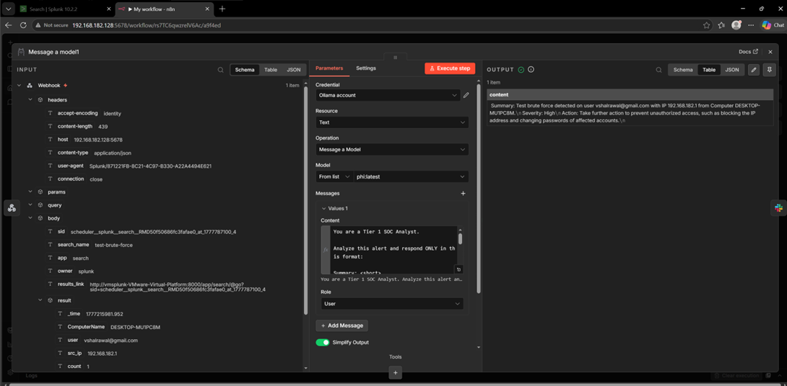

This provides the LLM with the important information from the Splunk alert while keeping the output short and consistent.

---
# Slack Alert Formatting

Inside the Slack node, the LLM output is formatted as a security alert:

```
🚨 *Security Alert*

{{$json.content.replace(/\\n/g, '\n')}}
```

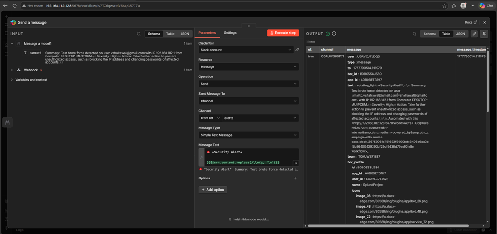

The `replace()` function converts escaped newline characters into actual line breaks so that the message is easier to read in Slack.

After executing the workflow, the generated security alert was successfully received in Slack.

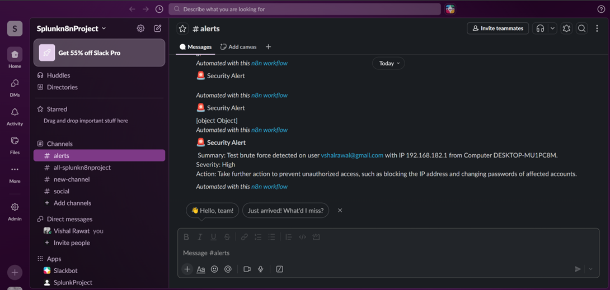