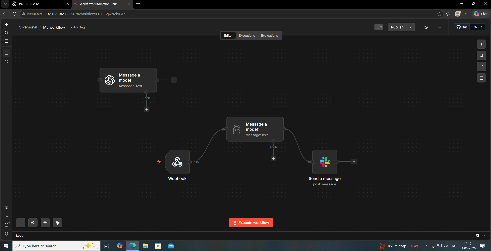
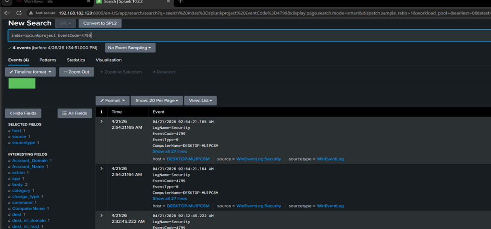
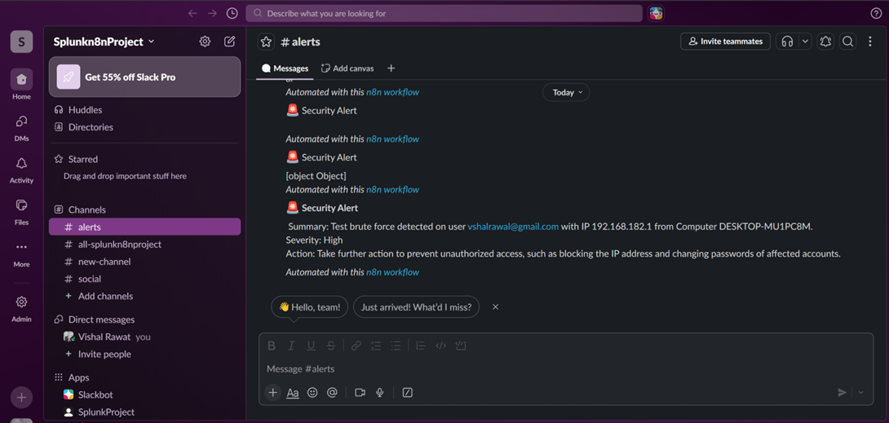

# 🔐 SOC Alert Automation using Splunk, n8n & AI

## 📌 Overview
This project demonstrates an **automated Security Operations Center (SOC) workflow** that detects suspicious activity in Windows logs using Splunk, processes alerts using AI, and sends structured notifications to Slack.

The goal is to reduce manual triage effort and enable faster incident response using automation.

---

## ⚙️ Architecture

### Windows Logs → Splunk → n8n → AI (Ollama/OpenAI) → Slack

---

## 🧠 Key Features

- 📊 Log ingestion using Splunk Universal Forwarder  
- 🚨 Detection of brute-force login attempts (EventCode 4625)  
- 🔗 Webhook integration between Splunk and n8n  
- 🤖 AI-based alert analysis (SOC Tier-1 style response)  
- 💬 Automated Slack alerts with structured output  
- ⚡ End-to-end SOC workflow automation  

---

## 🖥️ Lab Setup

| Component | Details |
|----------|--------|
| Windows 10 | Log source |
| Splunk | SIEM (log collection & detection) |
| n8n | Workflow automation |
| Ollama (Phi model) | Local AI processing |
| Slack | Alert notification |


## 🔍 Detection Logic

Splunk query used to detect failed login attempts:

```spl
index=splunkproject EventCode=4625 
| stats count by _time, ComputerName, user, src_ip
````

---

## 🔗 Workflow Explanation

1. Windows logs are forwarded to Splunk
    
2. Splunk detects failed login attempts
    
3. Alert is triggered via webhook
    
4. n8n receives alert data
    
5. AI model analyzes alert and generates response
    
6. Structured alert is sent to Slack
    

---

## 🤖 AI Prompt Example

```text
You are a Tier 1 SOC Analyst.

Analyze this alert and respond ONLY in this format:

Summary: <short>
Severity: <Low/Medium/High>
Action: <short>

Alert: {{$json.body.search_name}}
User: {{$json.body.result.user}}
IP: {{$json.body.result.src_ip}}
Computer: {{$json.body.result.ComputerName}}
Count: {{$json.body.result.count}}
```

---

## 💬 Slack Output Example

```
🚨 Security Alert

Summary: Brute force login detected
Severity: High
Action: Block IP and reset user credentials
```

---

## 📸 Screenshots

### 🔹 n8n Workflow



### 🔹 Splunk Alert



### 🔹 Slack Notification



---

## 🚀 How to Run

### 1. Setup Splunk

- Install Splunk
    
- Enable receiving port (9997)
    
- Create index: `splunkproject`
    

### 2. Configure Windows Forwarder

- Install Universal Forwarder
    
- Send logs to Splunk
    

### 3. Setup n8n

```bash
docker compose up -d
```

### 4. Configure Webhook

- Connect Splunk alert → n8n webhook
    

### 5. Setup AI

```bash
ollama pull phi
ollama serve
```

### 6. Configure Slack

- Create channel (#alerts)
    
- Add bot
    
- Connect in n8n
    

---

## 🎯 Results

- Fully automated SOC pipeline
    
- Reduced manual investigation
    
- Real-time alerting
    
- AI-assisted decision making
    

    

---

## 👨‍💻 Author

**Vishal Rawat**  